# SchoolID Collect

## Overview

**SchoolID Collect** is a Flutter application that generates school ID cards completely offline.

The app allows a user to:

- Select a school.
- Fill in the student information.
- Capture the student's picture.
- Generate the front and back sides of the ID card.
- Automatically create high-quality color PDF files.
- Share the generated PDF through WhatsApp or Email.
- Start another card immediately after completion.

The application does **not** use:

- ❌ Cloud Database
- ❌ Backend Server
- ❌ Authentication
- ❌ Internet connection for card generation

Everything is processed locally on the device.

---

# Project Workflow

1. Open the application.
2. Select the school.
3. Fill the student information.
4. Capture the student's photo.
5. Preview the ID card.
6. Generate front and back card images.
7. Generate a color PDF.
8. Share the PDF using WhatsApp or Email.
9. Success screen appears.
10. Repeat the process for another student.

---

# How New Schools Are Added

The application is designed so new schools can be added whenever needed.

Whenever a school requests their own card design, you only need to:

1. Add the school information.
2. Create the card design.
3. Register the new card.
4. Build a new APK.

No backend changes are required.

---

# Project Folder Structure

Below is the main folder structure used in the project.

> 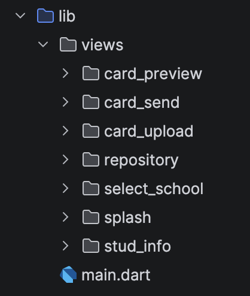

---

# Step 1 — Add School Information

Navigate to:

```text
lib/views/select_school/select_school_view.dart
```

> 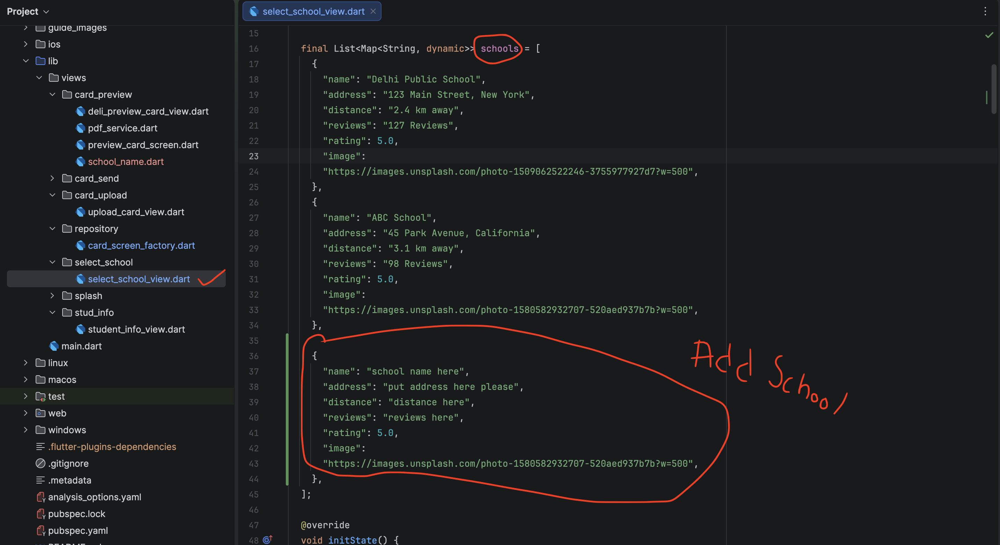

Inside this file, you will find a list named:

```dart
schools
```

This list contains all available schools.

It looks similar to this:

```dart
List<Map<String, dynamic>> schools = [
   ...
];
```

To add a new school, simply add another object at the end of the list.

Example:

```dart
{
  "name": "ABC School",
  "address": "45 Park Avenue, California",
  "distance": "3.1 km away",
  "reviews": "98 Reviews",
  "rating": 5.0,
  "image":
      "https://images.unsplash.com/photo-1580582932707-520aed937b7b?w=500",
},
```

If you don't have some information yet, simply leave it empty.

Example:

```dart
{
  "name": "ABC School",
  "address": "",
  "distance": "",
  "reviews": "",
  "rating": 0.0,
  "image": "",
},
```

> **Important**
>
> Every field should exist, even if its value is empty.

---

# Step 2 — Add or Modify Form Fields

Sometimes different schools require different information on their ID cards.

For example:

- Blood Group
- Roll Number
- Parent Name
- Bus Route
- Admission Number
- Class
- Section

If you need additional fields, you can modify the student form.

Navigate to:

```text
lib/views/stud_info/student_info_view.dart
```

> 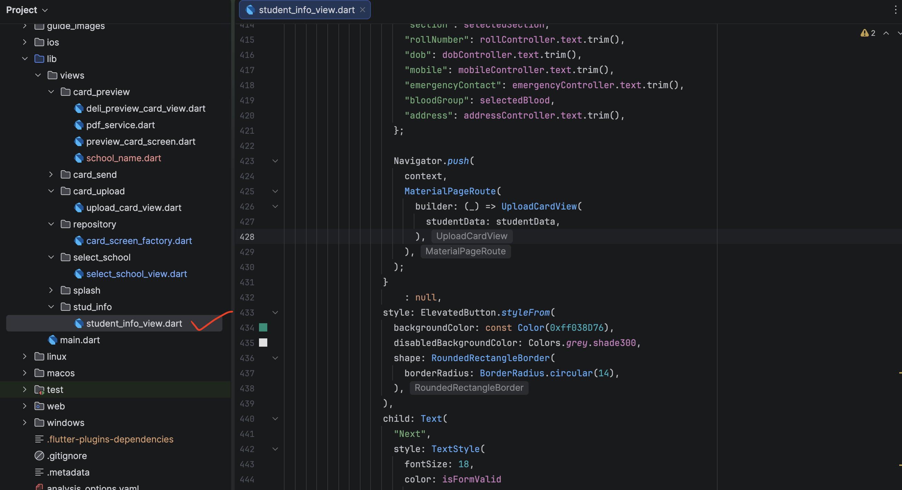

Add or remove the required fields according to the school's requirements.

---

# Step 3 — Create the Card Design

Now it's time to design the new school card.

Navigate to:

```text
lib/views/card_preview/
```

> 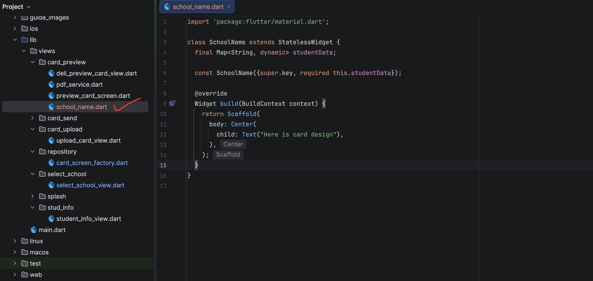

Create a new file.

Example:

```text
abc_school_preview_card_view.dart
```

This file will contain the complete card design for that school.

Example:

```text
lib/views/card_preview/
    abc_school_preview_card_view.dart
```

Only the card layout should be different.

The save, export, and PDF generation buttons remain the same for every school.

---

# Step 4 — Register the New Card

Now register the newly created card.

Navigate to:

```text
lib/views/repository/card_screen_factory.dart
```

Add a new case.

Example:

```dart
case "ABC School":
  return AbcSchoolPreviewCardView(
    studentData: studentData,
  );
```

---

## Important

The school name must exactly match the name entered inside:

```text
lib/views/select_school/select_school_view.dart
```

For example:

```dart
"name": "ABC School"
```

must match

```dart
case "ABC School":
```

Even a small spelling difference will prevent the correct card from opening.

> 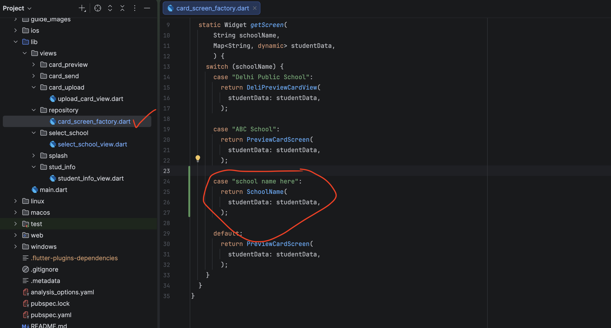

---

# That's It!

After completing these steps:

- The school appears in the selection screen.
- The correct card design opens.
- Student information is displayed.
- Card images are generated.
- PDF is created successfully.

Now you only need to build a new APK.

---

# Building the APK

The easiest way to build the APK is by using **GitHub Actions**.

This removes the need to install Android Studio or Flutter on another computer.

---

# Step 1 — Create a GitHub Repository

Create a new repository on GitHub.

> 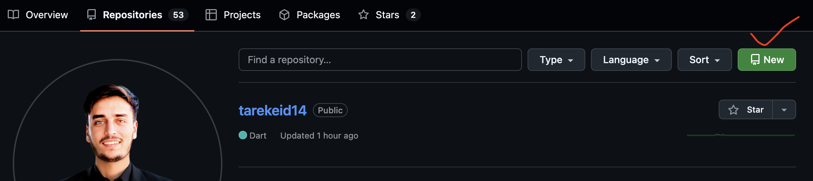
> 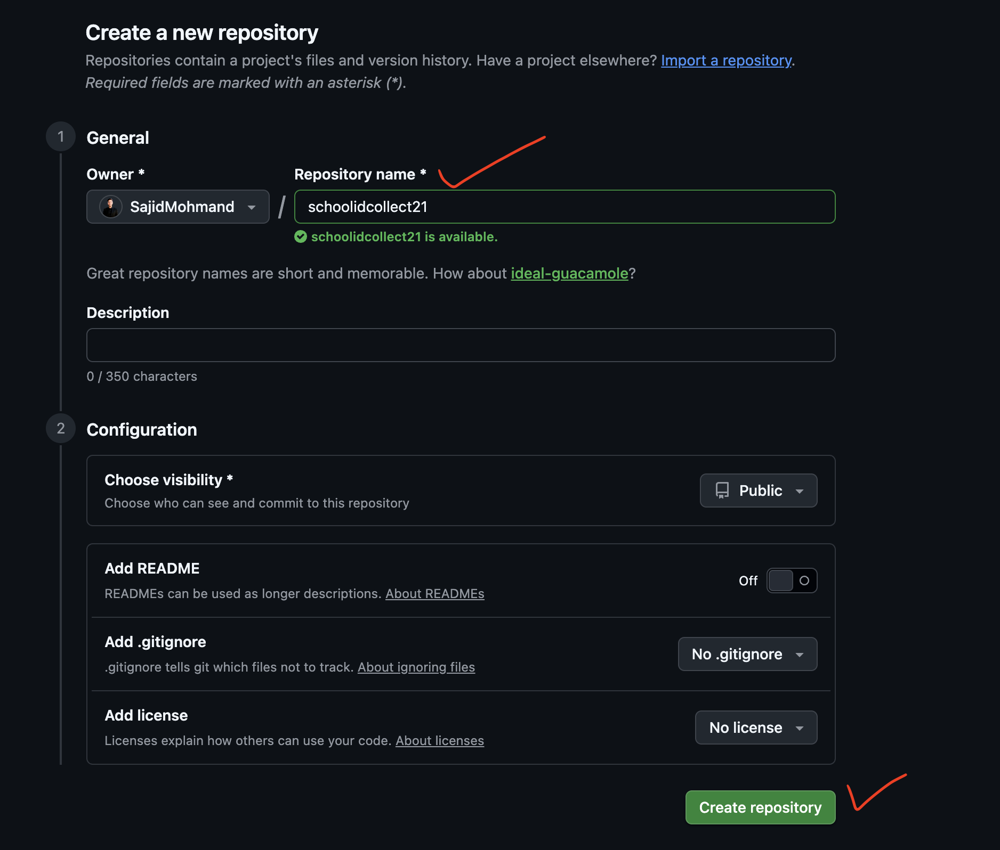

Upload your complete project.

---

# Step 2 — Upload the Project

Open your project folder.

Run the Git commands shown below.

> 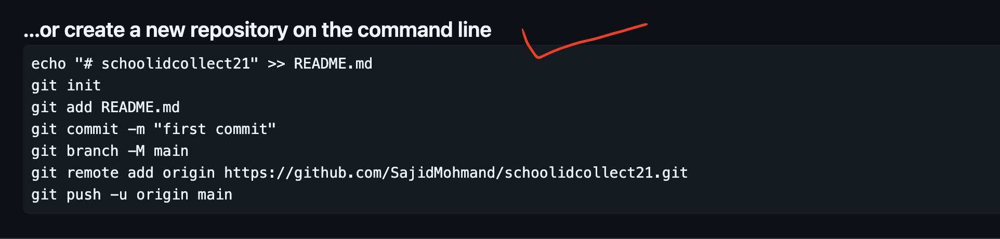

Example:

```bash
git init
git add .
git commit -m "Initial Commit"
git branch -M main
git remote add origin YOUR_REPOSITORY_URL
git push -u origin main
```

---

# Step 3 — Open GitHub Actions

Open your repository.

Go to:

```text
Actions
```

Search for:

```text
Dart
```

Then configure the workflow.

> 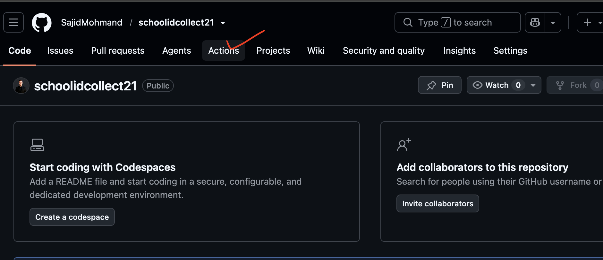
> 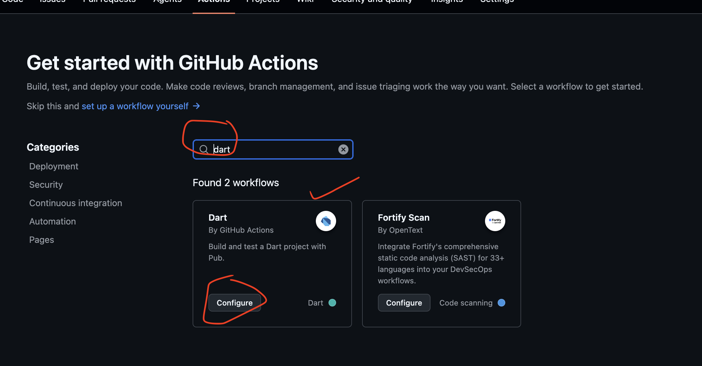

---

# Step 4 — Add the Workflow

Replace the generated workflow with the following code.


Paste the following code.

```yaml
name: Build Flutter APK

on:
  workflow_dispatch:
  push:
    branches:
      - main

jobs:
  build:
    runs-on: ubuntu-latest

    steps:
      - name: Checkout Repository
        uses: actions/checkout@v4

      - name: Setup Java
        uses: actions/setup-java@v4
        with:
          distribution: temurin
          java-version: '17'

      - name: Setup Flutter
        uses: subosito/flutter-action@v2
        with:
          flutter-version: 3.44.2
          channel: stable

      - name: Install Dependencies
        run: flutter pub get

      - name: Build APK
        run: flutter build apk --release

      - name: Upload APK
        uses: actions/upload-artifact@v4
        with:
          name: release-apk
          path: build/app/outputs/flutter-apk/app-release.apk
```

Commit the changes.

> 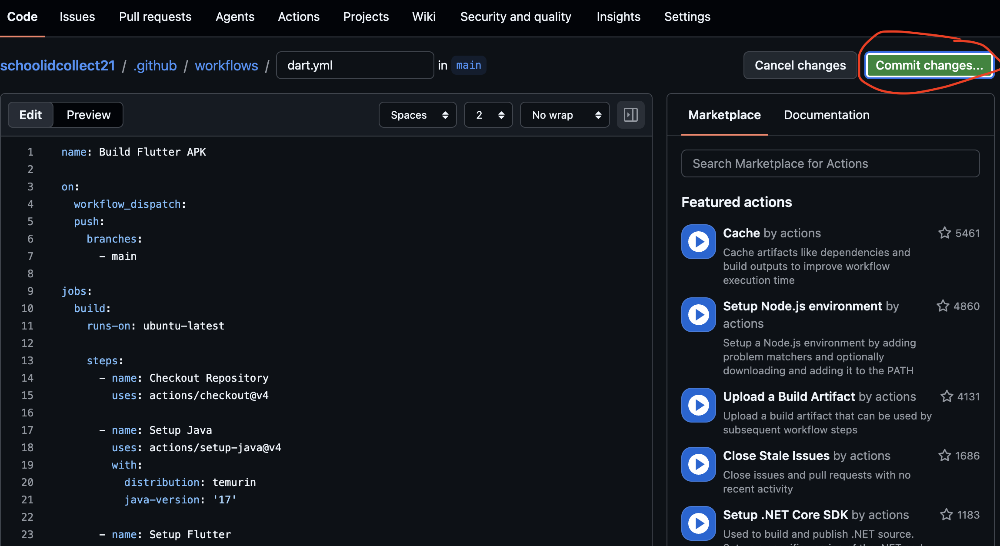

---

# Step 5 — Enable Workflow Permissions

Open your repository.

Go to:

```text
Settings
```

Then navigate to:

```text
Actions
```

↓

```text
General
```

> 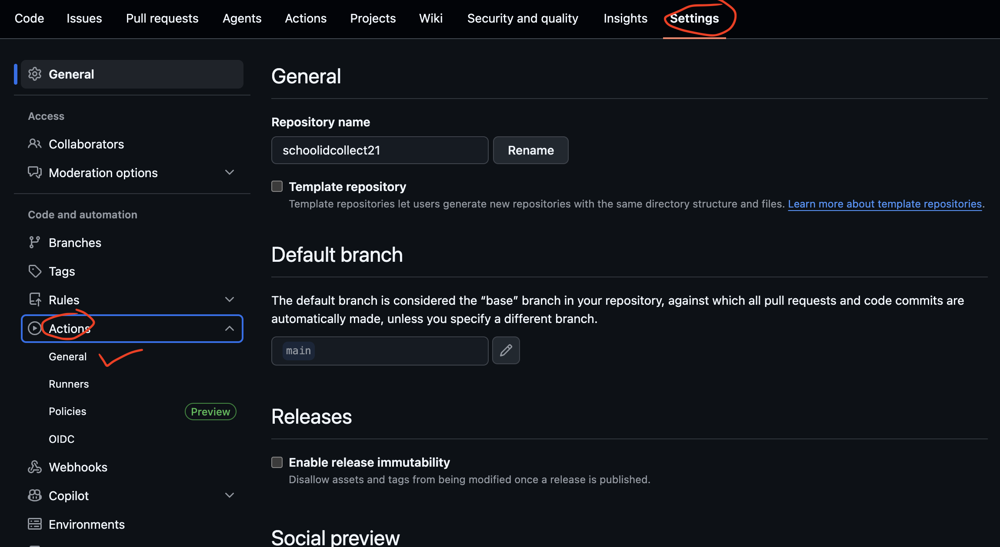

Scroll to the bottom.

Under **Workflow permissions**, select:

```text
Read and write permissions
```

Click **Save**.

> 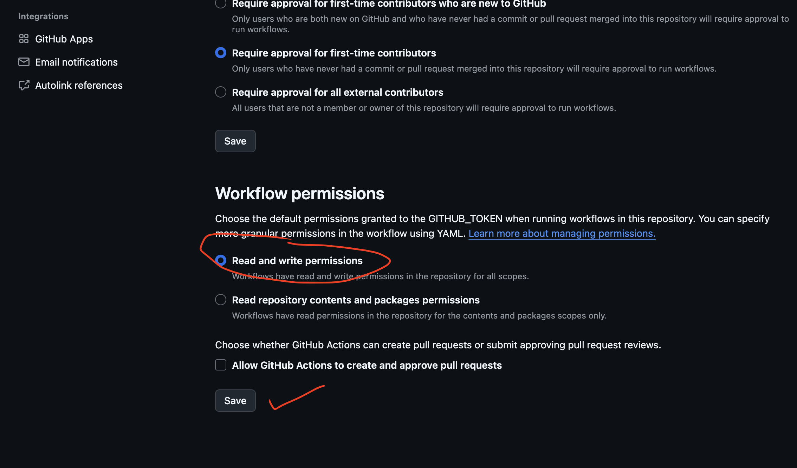

---

# Step 6 — Build the APK

Open:

```text
Actions
```

You will see the workflow running.

> 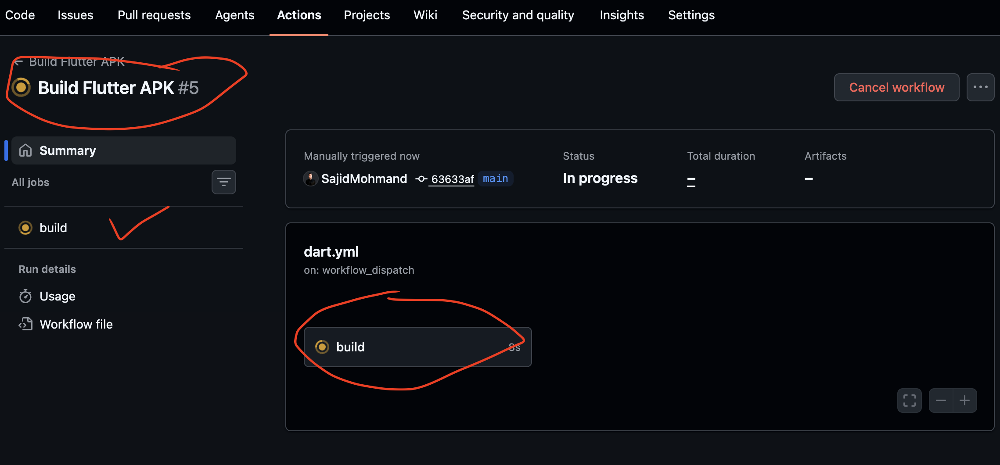

Wait until the workflow completes successfully.

---

# Step 7 — Download the APK

Open the completed workflow.

Scroll to the bottom.

You will find an artifact named:

```text
release-apk
```

Download it.

> 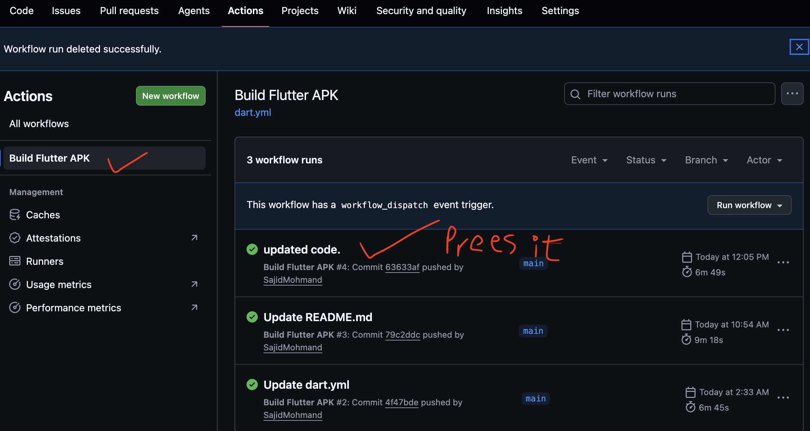
> 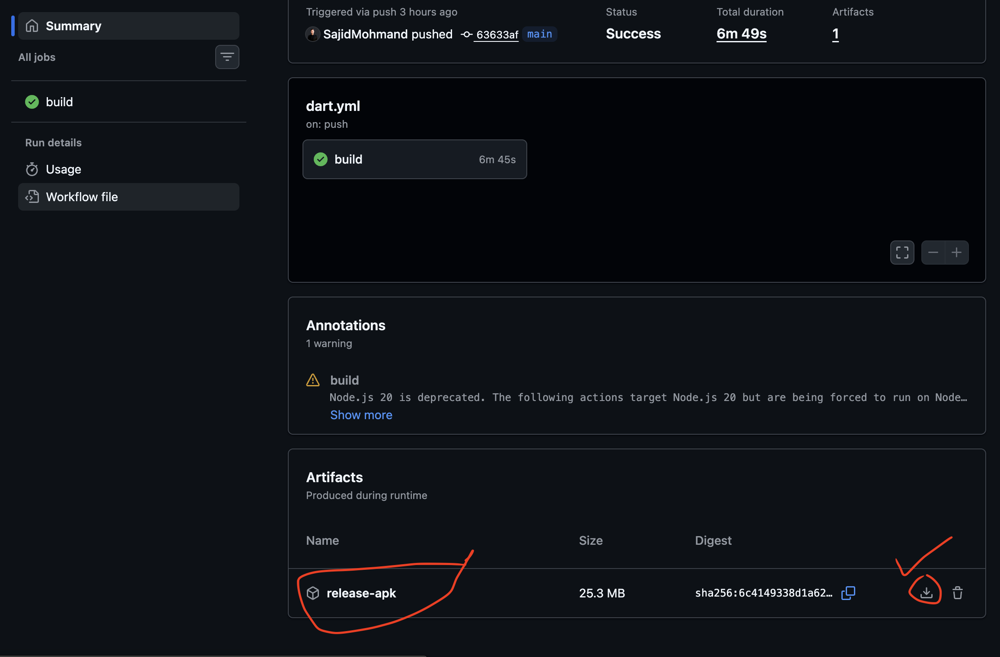


Inside the downloaded ZIP file, you will find the updated APK containing your newly added school.

Install it on your Android device and verify that the new school appears correctly.

---

# Final Notes

Whenever a new school requests their own ID card design, simply follow the same process:

1. Add the school information.
2. Update the form fields if needed.
3. Create a new card preview file.
4. Register the card in `card_screen_factory.dart`.
5. Push the changes to GitHub.
6. GitHub Actions will automatically build a new APK.
7. Download the generated APK and install it.

This approach keeps the application simple, fully offline, and easy to maintain while allowing unlimited schools to be added in future updates.

---

# Thank You

Thank you for using **SchoolID Collect**.

We hope this guide helps you easily maintain the project and add new schools whenever required.
